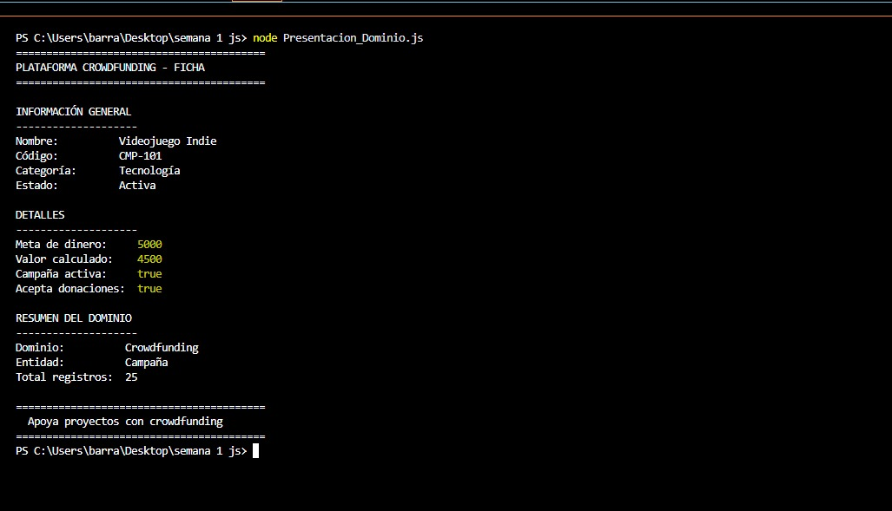

# Proyecto Semana 1 - 3407187

## Descripción

Este proyecto consiste en crear un script en JavaScript que muestre en la consola una ficha de presentación de una entidad dentro de un dominio específico.

En mi caso el dominio es una **plataforma de crowdfunding**, donde la entidad principal es una **campaña de financiación** similar a las que existen en plataformas como Kickstarter.

El programa muestra la información usando `console.log()` y se ejecuta con **Node.js**.

---

## Objetivo

Aplicar los conceptos básicos aprendidos en la primera semana del bootcamp:

- Uso de `console.log()`
- Tipos de datos primitivos
- Strings
- Numbers
- Booleans
- Expresiones aritméticas
- Comentarios en el código

---

## Información mostrada

El script muestra información de una campaña como:

- Nombre de la campaña
- Código o identificador
- Categoría
- Estado de la campaña
- Meta de financiación
- Un valor calculado usando una operación matemática
- Estados booleanos
- Resumen del dominio

---

## Tecnologías usadas

- JavaScript
- Node.js

---

## Cómo ejecutar el proyecto

1. Instalar Node.js
2. Abrir la terminal en la carpeta del proyecto
3. Ejecutar el siguiente comando:

```bash
node Presentacion_Dominio.js

